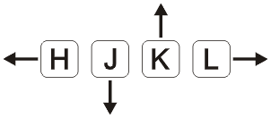

# Personal

## Patterns
`[count][operator]{motion}`

## Essential Navigation Commands

`Ctrl-f` - Move down one page. 
`Ctrl-b` - Move back up one page. 
`w` - Move forward by word including punc. 
`W` - Move forward by word not including punc. 
`b` - Move backward by word incluing punc. 
`B` - Move backward by word not including punc. 
`gg` - First line. 
`G` - Last line. 
`^` | `0` - Beginning of line. 
`$` - End of line. 
`{line number}gg` - Go to line. 
`{line number}G` - Go to line. 
`:{line number}` - Go to line. 
`:$` - Go to last line. 

## Deleting Text

`x` - Delete character. 
`X` - Delete character backwards. 
`d$` - Delete to end of line. 
`D` - Delete to end of line. 
`dw` - Delete word (end of word) not including punc. 
`dW` - Delete word (end of word) including punc. 
`db` - Delete word backwards (beginning of word) not including punc. 
`dB` - Delete word backwards (beginning of word) including punc. 
`d{count}w` | `d{count}W` - Delete multiple words. 
`dd` - Delete line. 
`{count}dd` - Delete multiple lines. 

## Cut, Copy, and Paste
`p` - Paste line below. 
`P` - Paste line above. 
`yy` - Yank line into default register. 
`y{count}W` - Yank multiple words. 
`"{number}p` - Paste from numbered register. 
`{letter}yy` - Yank to number register. 
`u` - Undo. 
'Ctrl-r` - Redo. 

## Notes
* Using the delete function will put expression in the temp registry. Usually the "".
* Yanking will save to the "0 register.
* `:reg {letter}` - Show register input.

## Misc
`Ctrl-G` - Display file info. 